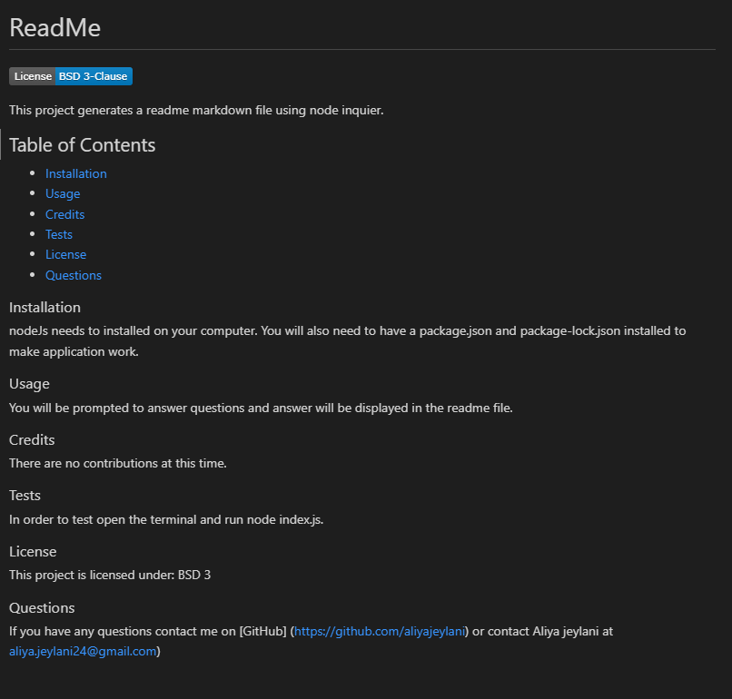

# Descrtiption
  This week's project is to generate as readme file using node inquirer in order to run a command line application that accepts user inputs. My application will prompt the user for information about their project that will encompass all of the elements needed (title, description, installation, usage, credits, tests and license) in order to generate a professional ReadME file. 

  Here's the link to the README generated by my application: 

  

  ### Installation
   To complete this project, I needed to install node.js on my computer to run code in the command line. I also needed to have a package.json and package-lock.json installed to make my application work.

  ### Usage

  Here is the link to my gitHub repository: https://github.com/aliyajeylani/professional_readme_generator

  ### Credits
  
  N/A

  ### License

  N/A

 